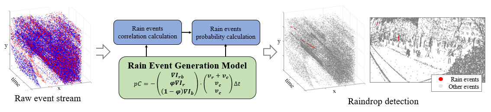

# Event-Based Rain Dataset

[](https://youtu.be/b5UIEF8_AY8)

This dataset include raindrops recorded by an event camera (Prophesee Gen4 HD), with manual labels.  


Top row: raw data with labels; Bottom row: rain detection results (by our proposed method, codes not released).   
Check this [video](https://youtu.be/b5UIEF8_AY8) to view the rain detection results.

## Citation

If you use this dataset in an academic context, please cite the following paper (accepted):

Junyu Yang, Yan Dong, Zhennan Long, Xin Yang, Bin Han, "Rain detection algorithm based on event camera", XXX, 2022.
```bibtex
xxx
```


## Datasets

### Dataset description
This dataset include events data in rainy days on three different scene: `static`, `dynamic`, and `moving`.  
`static`: the event camera is staic with (nearly) no moving objects in view. Events are caused by only rain and noise.  
`dynamic`: the event camera is static, but there are some moving objects (e.g. cars, people) in view.  
`moving`: the event camera is slowly moving. All object (static or moving) appear in view.  

### Ground truth
On each sequence, we labeled the raindrop with a bounding box, by firstly drawing the "time-surface" of during 30ms sequence, and then select the raindrops based on the visual information.  

Since some line-structure in scene has a similar view, we decided is the raindrop if the "line" is approximately vertical & the timesteps increase (indexed by the time-surface color) from top to bottom. However, we negelected very short raindrops. 

### Data format
Each scene includes 100 sequences of 30ms data.

Each `.csv` file in "dataset/*scene*/data" folder includes the events:
```txt
t,x,y,p
0,677,258,0
19,675,235,0
...
```
where `t` is the timestamp in us. `x,y` is coordinate of events. `p` is polarity (0/1 for off/on events)

Each `.csv` file in "dataset/*scene*/data_label" folder includes bounding box labels:
```txt
x1,y1,x2,y2
147,3,175,128
112,122,123,256
...
```
where `x1,y1` is the up-left point and `x2,y2` is the bottom-right points of each raindrop.

### Data visualization
We also provide scripts to visualize the events & bounding box of the raw data. Run: 
```bash
python utility/show_data.py --input_folder="dataset/static" --input_seq=1
```


## Known issue
The label may not be very accurate due to the noise & background events in `moving` scene.  
Current dataset was only recorded in small rain. We will provide more sequences in future.

## Contact
Pull an issue, or contact LarryDong(jfjxxdy2007@126.com)
